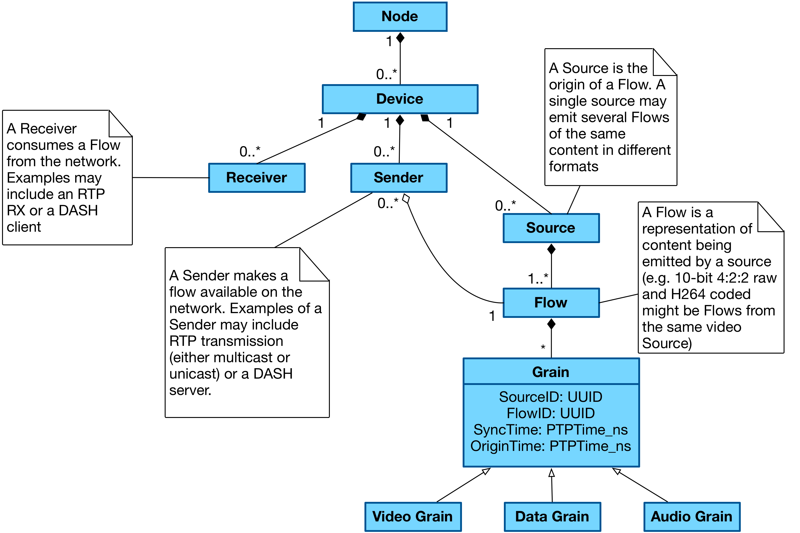
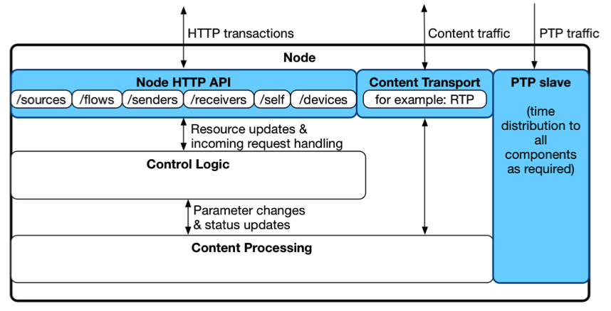
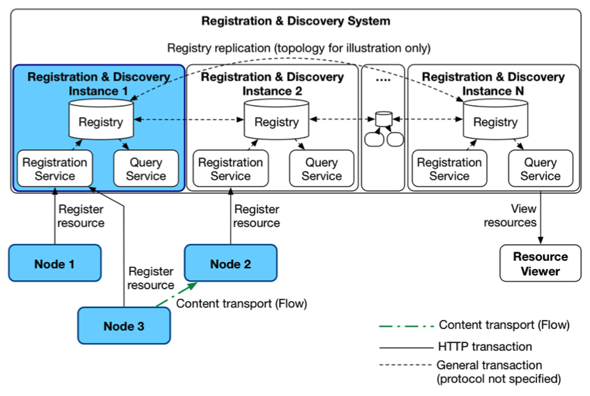
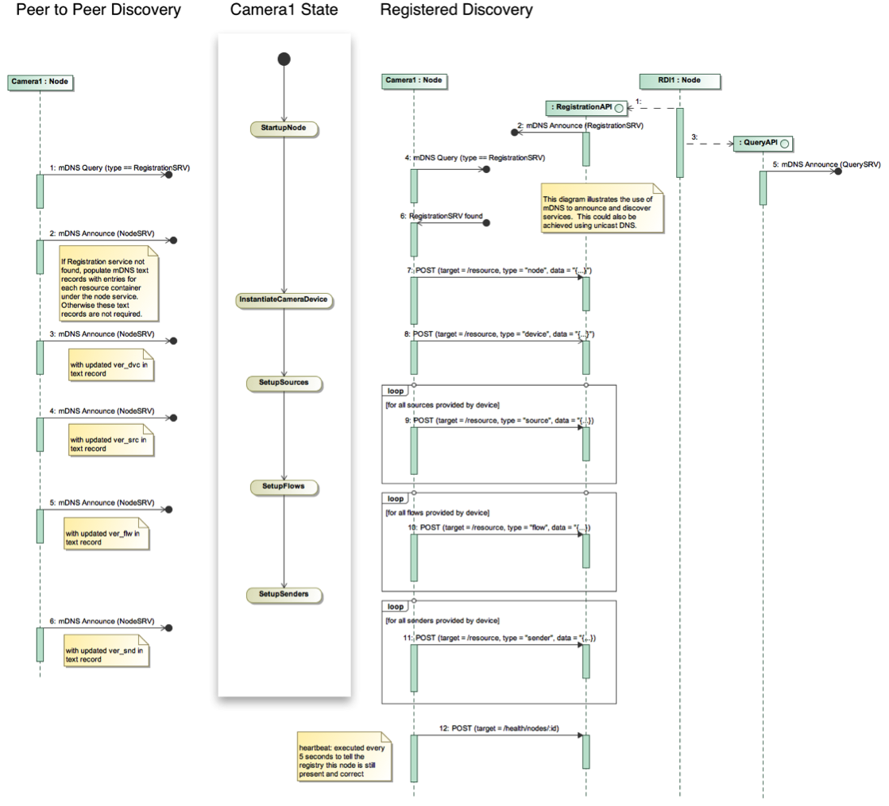
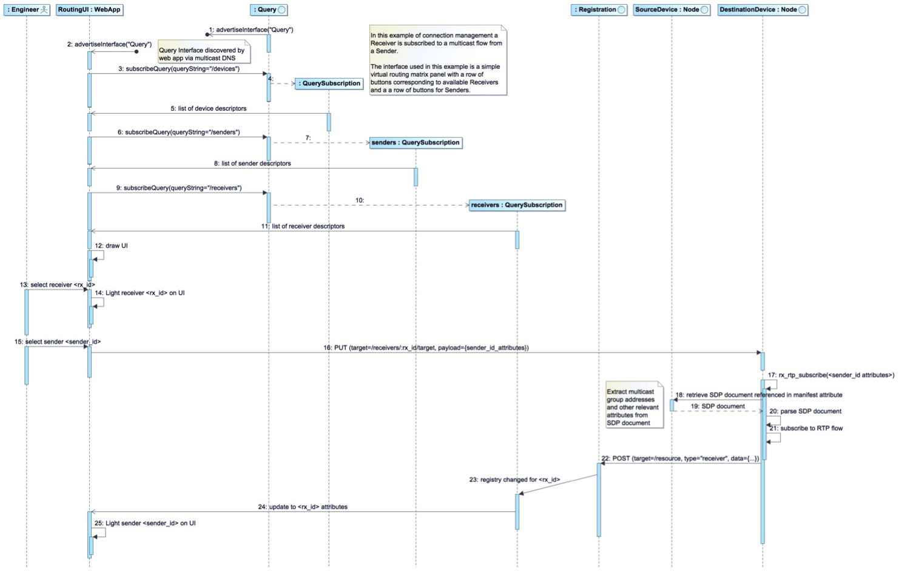

# NMOS Technical Overview

_(c) AMWA 2016, CC Attribution-ShareAlike 4.0 International (CC BY-SA 4.0)_
q
## Introduction

The Advanced Media Workflow Association are creating a family of Networked Media Open Specifications (NMOS)

This document provide a high-level technical overview of the NMOS data model and API specifications, including examples of how these may be used.

Please check the NMOS public GitHub repository for the latest version of this document, the specifications and supporting material:

[github.com/AMWA-TV/nmos](https://github.com/AMWA-TV/nmos)

*NOTE: at the time of writing, some supporting material* *is* *not yet available at* *this* *repository. Please contact AMWA for information about accessing these items.*

This overview document is non-normative.

## Data Model Overview

| Relevant specifications and supporting material for this topic
|:-----------------------------------------
| NMOS Mapping of Identity and Timing Information to RTP
| Identity, Timing and Sync Scenarios
| Timestamps: Lifetimes and Synchronisation

NMOS uses a logical data model based on the [JT-NM Reference Architecture](http://www.jt-nm.org/RA-1.0/) to add identity, relationships and time-based information to content and broadcast equipment. Hierarchical relationships group related entities, with each entity having its own UUID (ID and UUID are used interchangeably in this document).

The traditional assumption of *"different connectors for different signals"* is replaced by the use of logical interfaces on common network interfaces, exposing video, audio and data inputs and outputs, and control parameters. This makes communication easier and helps with virtualisation of broadcast equipment, with multiple devices operating on a shared physical host.

Data modelling -- identifying the important parts of a system and the relationships between them -- has an essential role to play in specifying what goes over the logical interfaces and will be an essential part of the transition of broadcasting and media production infrastructure to make the most of IP.

### Node

**Nodes** are logical hosts for processing and network operations. They may have a permanent physical presence, or may be created on demand, for example as a virtual machine in a cluster or cloud. Connections between Nodes through which content is transported are created to build a functioning broadcast plant.

### Devices

Nodes provide **Devices**, which are logical groupings of functionality (such as processing capability, network inputs and outputs).

### Sources, Flows and Grains

Devices with the capability to originate content must provide an abstract logical point of origin for this, called a **Source**. A Device may have multiple Sources.

Sources are the origin of one or more **Flows**, which are concrete representations of content.

Flows are composed of sequences of **Grains**. A Grain represents an element of Essence or other data associated with a specific time, such as a frame, a group of consecutive audio samples, or captions.

Grains also contain metadata information that specifies attributes such as the temporal duration of the payload, useful timestamps, originating Source ID and the Flow ID the grain is associated with.

As an example, consider the above concepts in the context of a video camera with an on-board microphone:

-   The camera itself is a Node, which provides a single Device with two Sources (one audio Source, one video Source).

-   The audio Source provides a single audio Flow.

-   The video Source provides (for the purposes of this example) two video Flows, one uncompressed, the other mezzanine encoded.

### Senders and Receivers

Devices transmit and receive Flows over the network using **Senders** and **Receivers.** These can be respectively considered as "virtual output ports" and "virtual input ports" on the Device. Receivers connect to Senders in order to transport content.

## Accessing a Node's resources

| Relevant specifications and supporting material for this topic
|:-----------------------------------------
|  NMOS Node API Specification         |

Each Node represents the resources in its data model using a RESTful HTTP API, the structure of which is described in the *Node API specification* document.

## Identification, synchronisation and transport of Flows

| Relevant specifications and supporting material for this topic
|:-----------------------------------------
| NMOS Mapping of Identity and Timing Information to RTP
| Identity, Timing and Sync Scenarios
| Timestamps: Lifetimes and Synchronisation

Each Grain contains Flow and Source UUIDs as well as other attributes such as an **Origin Timestamp** and **Synchronisation Timestamp** (these are often identical, but may differ in some cases; see the supporting documents for further information on timestamps and their uses).

How this data travels between Nodes depends on the transport protocol being used. For each transport, the NMOS data model must be mapped into appropriate places in the protocol.

As an example, RTP is typically used for real-time transport. RTP provides customisable **header extensions** into which the NMOS data model fields are inserted.  

## Timing Model

| Relevant specifications and supporting material for this topic
|:-----------------------------------------
| Identity, Timing and Sync Scenarios
| Timestamps: Lifetimes and Synchronisation

The NMOS Timing model has been designed to be used with a clock derived from PTP in order to synchronise Devices within a facility. By pairing this clock with a GPS source, absolute timing accuracy between geographically distributed locations can be ensured. As per SMPTE ST 2059-1, an epoch of 1970-01-01T00:00:00TAI is used, with zero phase at the epoch for periodic signals.

The capture of essence such as video frames is governed by this clock, providing frame synchronisation between discrete Devices. Each Grain is timestamped using the PTP clock in order to provide the means for synchronisation of Flows where required, and unique identity for Grains in time. Two timestamps are used for each Grain:

-   **Origin Timestamps** provide the original sampling instant of the media at the edge of the system, uniquely referenceable for all time.

-   **Synchronisation Timestamps** provide a means to cross-reference between Flows which may have passed through the network fabric via different paths, or passed through processing chains (such as codecs) which impose different levels of delay.

By pairing these timestamps with Flow identifiers, it is possible to track a video frame or other essence through its chain of ancestors right back to the Device which originally captured it and the instant in time when that occurred.

## Example System Architecture

This section describes the overarching structure of a broadcast plant using NMOS data model and APIs. It explores how Nodes communicate, and how a multi-Node system is created.

### Node Structure

| Relevant specifications and supporting material for this topic
|:-----------------------------------------
|  NMOS Node API Specification

Regardless of their implementation, viewed logically, Nodes provide:

-   An HTTP API to allow clients to view and manipulate the Node data model.

-   Interfaces (in the logical sense) through which content is transported.

-   A PTP slave for timing and synchronisation.

More detail on the Node HTTP API is contained in the *Node API specification.*

NMOS does not specify the internal interfaces within a Node.

### Registering and Discovering Nodes

| Relevant specifications and supporting material for this topic
|:-----------------------------------------
|  NMOS Node API Specification
|  NMOS Registration API Specification
|  NMOS Query API Specification
|  Peer-to-Peer Operation

Node and resource discovery is an important component of the NMOS family of specifications. There are two ways in which this can take place, **peer-to-peer** and **registered**. Note that these two mechanisms may co-exist if this is operationally useful.

### Peer-to-Peer Discovery

Peer-to-peer (P2P) discovery requires no additional infrastructure. Nodes make DNS Service Discovery (DNS-SD) announcements regarding the presence of their Node API. Peers browse for appropriate DNS records and then query the node HTTP API for further information.

For further information read *Peer-to-Peer Operation*

### Registered Model

Registered discovery takes places using a **Registration & Discovery System (RDS)**, which is designed to be modular and distributed. An RDS is composed of one or more **Registry & Discovery Instances (RDIs)**. Each RDI provides three services:

-   A **Registration Service**

-   A **Query Service**

-   A **Registry** storage backend.

The Registration Service provides a HTTP endpoint which Nodes POST into to register themselves and their resources. The Registration Service also manages garbage collection of Nodes and their resources by requiring Nodes to send regular keep-alive/heartbeat messages.

The Query Service provides a HTTP endpoint from which clients can GET lists of resources. Typical usage examples include:

-   Obtaining a list of registered Nodes in order to drive a configuration interface.

-   Obtaining a list of Sender resources and a list of Receiver resources in order to provide a connection management interface.

The Query API also provides the ability to generate ‘long lived’ queries using its Subscription mechanism and WebSockets. This is further described in the *NMOS Query API Specification*.

More detail on registered discovery is provided in the *Registration*, *Query* and *Node API* specification documents.

## Connection Management

| Relevant specifications and supporting material for this topic
|:-----------------------------------------
| Example SDP file for RFC4175 video stream
| Example SDP file for L24 audio stream
| Example SDP file for ST.291 ANC stream

Sender and Receiver resources enable connectivity between Nodes. Senders expose a description of what Flow they are sending and how to access it (the ‘manifest href’).

For RTP, we use **SDP** files as our ‘manifest’. Senders expose an SDP file that describes the location (and type) of the Sender’s RTP stream.

To form a connection between two Nodes, a connection manager PUTs some structured data about a Sender (including a reference to the manifest href) to a Receiver. The Receiver parses the manifest and begins accessing the stream.

Each time a Receiver changes the Sender it is receiving from, the Node resource describing the Receiver must be updated on the Node, and also the Node must notify the Registration & Discovery system.

Further information on this topic is available in the *NMOS Node API Specification*, and the example SDP files. The diagram below also illustrates a typical connection management sequence.

## Content Transport

| Relevant specifications and supporting material for this topic
|:-----------------------------------------
| NMOS Mapping of Identity and Timing Information to RTP
| RFC 4175 RTP stream packet capture (with NMOS header extensions)    
| L24 audio RTP stream packet capture (with NMOS header extensions)   
| ST.291 ANC RTP stream packet capture (with NMOS header extensions)  

NMOS’s content model can be applied to several types of payload format and transport protocol, including, but not limited to:

-   Uncompressed video over RTP according to RFC 4175

-   Uncompressed audio over RTP according to RFC 3190

-   ST.291 ANC data over RTP according to draft-ietf-payload-rtp-ancillary-02

*NMOS Mapping of Identity and Timing Information to RTP* describes how the above mappings, including RTP header extensions to carry identity and timing information and signal Grain boundaries. These can be extended to support e.g. mezzanine compression formats such as VC-2.
