# NMOS Technical Overview

_(c) AMWA 2018, CC Attribution-ShareAlike 4.0 International (CC BY-SA 4.0)_

For the latest version of this document please go to <https://github.com/AMWA-TV/nmos>.

[//]: # (ToC goes after this comment. Generate with gen-toc.sh <this-file> and paste in.)

[//]: # (ToC goes before this comment.)

- [Introduction](#introduction)
  - [Background](#background)
  - [General Principles](#general-principles)
- [NMOS Model and Terminology](#nmos-model-and-terminology)
- [The Specifications](#the-specifications)
  - [Discovery and Registration Specification (IS\-04)](#discovery-and-registration-specification-is-04)
  - [Device Connection Management Specification (IS\-05)](#device-connection-management-specification-is-05)
  - [Network Control Specification (IS\-06)](#network-control-specification-is-06)
  - [Event and Tally Specification (IS\-07)](#event-and-tally-specification-is-07)
  - [Parameter Registers](#parameter-registers)
  - [Natural Grouping (future BCP\-002\-01)](#natural-grouping-future-bcp-002-01)
  - [Audio Channel Mapping (IS\-08)](#audio-channel-mapping-is-08)
  - [Securing Communications (BCP\-003\-01)](#securing-communications-bcp-003-01)

## Introduction

Networked Media Open Specifications ([NMOS]) are a family of specifications that support the professional AV media industry's transition to a "fully-networked" architecture. The NMOS specs are developed by the Advanced Media Workflow Association ([AMWA]) and are published on GitHub.

This page provides a technical overview of NMOS.  It's a work in progress, and will be updated with information currently in a legacy document in this repository.

### Background

While much of the broadcast industry has moved to file-based operation, live facilities have long depended on specialist technologies such as the [Serial Digital Interface] (SDI), [SMPTE Timecode] and various incompatible control protocols (including some using RS-232, some of which are still in use).  However (as of 2017) there is a significant move towards replacing these with more general IT/IP technologies, allowing the industry to benefit from the high speeds and economies of scale that have enabled the success of the Internet and Web.

Standards bodies including SMPTE and AES have created specifications for streaming of uncompressed video and audio over IP.  These use RTP and include [ST 2022-6] for SDI-based payloads, [AES-67] for audio-only payloads and the forthcoming [ST 2110] for separate video, audio and ancillary data over IP.  However none of these tackle the control or application planes, leaving significant additional work to be done to achieve useful interoperability in professional networked media environments. So a number of industry bodies came together in 2013 on the Joint Task Force on Networked Media ([JT-NM]) to coordinate how this might happen. This led to the creation of a "reference architecture" for interoperability ([JT-NM RA]). At its most basic this identifies models and best practices for what may be needed at four layers: operation, application, platform and infrastructure.

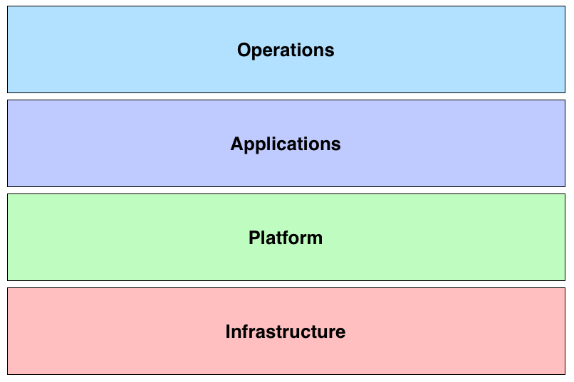

This is where the Advanced Media Workflow Association ([AMWA]) comes in.  AMWA is an industry group of manufacturers, developers and end users, that is trying to advance a software-focussed approach to support future professional media operations.  What this means in practice is identifying how to build upon "commodity" infrastructure (red layer) and widely used platform technologies/protocols (green) layer and supplement these where required with helpful specifications that build upon these building blocks.  AMWA has done this in the past with "application specifications" for file-based interchange and delivery, and is now doing this for networked media with the NMOS specifications, which are being created by AMWA's Networked Media Incubator group. These provide a open set of APIs to support interoperability for networked media applications:

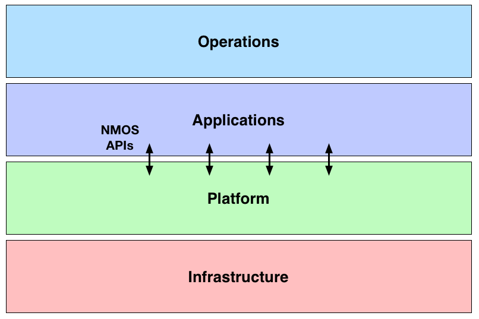

### General Principles

When creating NMOS specifications we try to follow a number of general principles, which will be familiar to today's developers.

#### Web-friendly protocols

In the past specialised wire protocols have often been used for the control plane within facilities.  However networked media operations are becoming increasingly distributed across locations, and sometimes across organisational boundaries, including third-party/public cloud providers.  So it is desirable to use protocols that are aimed at such environments. HTTP and WebSockets are examples of these, and this is what NMOS currently uses.

There is a huge amount of work happening in the wider IT/IP industry on optimising these protocols and their implementation, making previous arguments about the performance of specialised protocols less relevant.

#### Developer-friendly APIs

A decade ago, typical control APIs used an "RPC-style" approach based on SOAP, XML, XSD and WSDL, leading to quite complex code and messages. Modern developers of web APIs typically use a REST (or at least "REST-like"—see below) approach with simpler messages based on JSON and a lightweight approach to schemas using e.g. RAML and JSON Schema.  

NMOS adopts this modern approach.

#### REST

Although "REST" is often used to mean any simple HTTP API, in creating the NMOS specs we have tried to adopt "correct practice" such as statelessness, uniform interface, resource identification in requests, HATEOAS, etc. (The [Wikipedia REST page] has a good summary of these.)  But as there are no hard rules on this, and a certain amount of pragmatism has also been used, especially for more control-oriented activities such as connection management.

#### Technology independence through data modelling

This might seem to conflict with some of the above, but it doesn't have to. In creating the NMOS specifications we have started with (UML) data models, which you will see in the NMOS repositories. The HTTP/WebSockets/RAML/JSON

 and then mapped these to JSON/HTTP/WebSockets/whatever. But should the wider IT/IP world migrate to new technologies, alternative mappings of the data models could feature in updated spec

You can see this explicitly in the relation between the logical content model and the RTP mapping specification. The IS-04 and IS-05 specifications you see on GitHub  

#### Build on widely used and open foundations

The success of HTTP and WebSockets is in part due to their open nature, being made available through IETF RFCs. The same applies to RTP, which is the basis of much industry activity on live IP at present.

#### Openly available specifications

We are using GitHub repositories to publish the specifications. These are made public as soon as is sensible, and of couse are available at no cost (AMWA is using a "RAND-Z" model for this work).  We use the Apache 2.0 open source licence for specifications (and the current open-source implementations).

#### Self-documenting specifications

Much of the "normative" part of the NMOS specifications takes the form of RAML and JSON Schema (with text-based supporting information). This allows

#### Scalable

The Internet/Web has scaled well so far (shortage of remaining public IPv4 addresses notwithstanding). NMOS APIs are built from Internet/Web technologies, so should also scale. That's the theory – at the time of writing this we are planning some practical work to study/prove this is the case, including documenting best practice.

#### Securable

Huge amounts of resources are spent on ensuring the world can use the Internet/Web securely.  NMOS APIs are built from Internet/Web technologies, so should benefit.  Again, that's the theory – so far Incubator workshops have used plain HTTP/WebSockets for expediency, but the specifications support HTTPS/WSS.  At the time of writing this we are planning some practical work to study/prove this is the case, including documenting best practice (such as what authentication, authorisation and audit technologies are well suited to networked media applications).

#### Suitable for all types of platform

Professional media has to work in many different types of environment, requiring a range of types of equipment. This means that NMOS specifications have been designed to work on many types of platform, such as:

- low-power devices, used on location and connected on a local network
- rack-mounted equipment within a fixed facility in a television centre
- virtualised in an on-premesis data centre
- on a shared or public cloud

#### Universal Identity

In NMOS specifications, everything is treated as a resource that can be uniquely identified. This is discussed in depth in the "Identity Framework" section of the [JT-NM RA]. In practice it means that every resource has a UUID/GUID that can be generated locally (rather than being assigned by a central authority). This UUID is then used within JSON messages and as part of RESTful URIs.

#### Flexible content

NMOS's content model reflects the richness of use of content in modern productions. Video, audio and data are treated as separate elements with their own identity and timing information. This allows them to be handled as required during production and rendered for consumption as needed for the platform(s).

#### Use rather than invent

NMOS specifications apply techniques used more generally for the professional media industry. Where possible we use protocols, representations, technologies, etc. that have proved successful elsewhere.

#### Benefit from modern tooling

Similarly the NMOS specifications have been written with the intent that they will be implemented using technologies that are widely known by developers with experience of network and web development.

#### Guided by JT-NM RA

This has already been mentioned, but it underpins how work on future NMOS specifications is likely to develop, as it ensures the work stays relevant across a broad community.

## NMOS Model and Terminology

Before explaining the NMOS specifications themselves it is helpful to present the model we are using in a sequence of pictures. This will also introduce some of the terminology used in NMOS specifications – this is similar to that used in the [JT-NM RA]. Be warned that in some cases common words (such as "Device") are used to represent "logical" things and so may not mean what you expect.  A more complete list of NMOS terminology is provided in the [Glossary].

In NMOS specifications a **Device** represents a _logical_ block of functionality, and a **Node** is the host for one or more Devices.

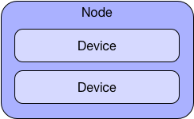

Devices have _logical_ inputs and outputs called **Receivers** and **Senders**, for example:

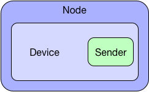

or:

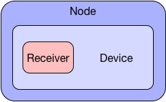

or:

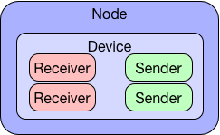

Devices, Senders and Receivers are all **Resources**. A Resource is a uniquely identified and addressable part of a networksed system:

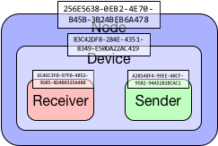  

As an example, consider an IP-enabled camera. Associated with it there will probably be a Node, a Device, A video Sender, an audio Sender (if it has microphones), and maybe a data Sender (e.g. for position data), and perhaps Receivers for reverse video, intercom and control data.

NMOS uses the term **Flow** for a sequence of video, audio, or time-related data, which can _flow_ from a Sender to a Receiver or Receivers. A Flow is treated as a resource and has a unique ID:

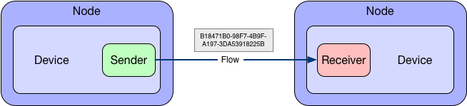  

The elements within the Flow are called **Grains**. An example of a Grain is a video frame.  Grains are associated with a position on a timeline:

Although Grains often are regularly spaced, they don't have to be, for example in the case of Data Grains representing irregular events:

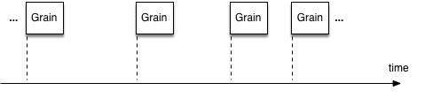

Each Flow is also associated with a **Source**. This is the _logical_ originator of the Flow:

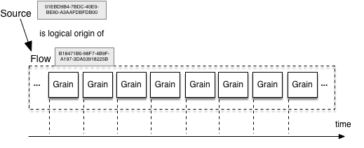

So in the NMOS model, a camera could be have several associated resources:

- Node
- Device
- Video, Audio and Data Sources
- Video, Audio and Data Senders
- Video, Audio and Data Receivers (for tally, viewfinder and comms)
- Video, Audio and Data Flows

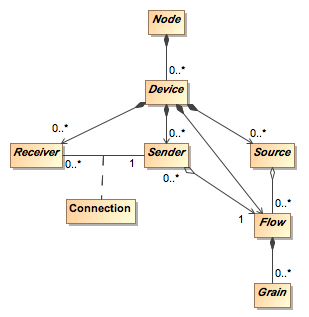

So far, NMOS specifications have worked with quite fine-grained Resources (pun unavoidable).  Future NMOS specifications will consider functionality and content at a higher level, for example for detailing with "bundles" of Flows.

## The Specifications

This section outlines the publicly available NMOS specifications

### Discovery and Registration Specification (IS-04)

<https://amwa-tv.github.io/nmos-discovery-registration>

This Specification enables applications to discover networked resources, which is an important first step towards automation and scalability.

It specifies:

- an HTTP **Registration API** that Nodes use to register their resources with a **Registry**.
- an HTTP **Query API** that applications use to find a list of available resources of a particular type (Device, Sender, Receiver...) in the Registry.
- an HTTP **Node API** that applications use to find further resources on the Node.
- how to announce the APIs using DNS-SD, so the API endpoints don't have to be known by Nodes or Applications.
- how to achieve "peer-to-peer" discovery using DNS-SD and the Node API, where no Registry is available.

It also includes a basic connection management mechanism that was used before the creation of IS-05 (see below). This is deprecated, and will be removed in later versions of IS-04.

### Device Connection Management Specification (IS-05)

<https://amwa-tv.github.io/nmos-device-connection-management>

This Specification provides an HTTP API for establishing (and removing) Flows between Senders and Receivers.

This allows the connection to made in a way that doesn't require knowledge of the transport protocol that will be used. It can be used for both unicast and multicast connections, and to initiate a connection made by a separate controller application.

It allows connections to be prepared and "activated" at a particular time and allows multiple connections to be made/unmade at the same time (sometimes known as "bulk" or "salvo" operation).

### Network Control Specification (IS-06)

<https://amwa-tv.github.io/nmos-network-control>

This Specification can be considered as a "northbound API" for SDN controllers. It provides an HTTP API to communicate information about the network topology, allow reservation of bandwidth for low-level network flows and monitoring.

### Event and Tally Specification (IS-07)

<https://amwa-tv.github.io/AMWA-TV/nmos-event-tally>

This Specification provides a mechanism for conveying time-related state and state change information, for example tally information from sensors and actuators using WebSockets or a message queue (MQTT).

### Parameter Registers

<https://amwa-tv.github.io/nmos-parameter-registers>

The Parameter Registers provide an extensible mechanism for defining values used within NMOS Specfications. Currently these use URNs. For example some NMOS resources have a `format` property, and `urn:x-nmos:format:video` provides a formal way of using this.

### Natural Grouping (future BCP-002-01)

<https://amwa-tv.github.io/nmos-grouping/best-practice-natural-grouping.html>

This defines how to tag related resources, such as a group of Senders belonging to the same Device or Node, or a group of Receivers belonging to the same Device or Node.

### Audio Channel Mapping (IS-08)

<https://amwa-tv.github.io/nmos-audio-channel-mapping/>

This will set channel mapping/selecting/shuffling settings for use with NMOS APIs.

### Securing Communications (BCP-003-01)

<https://amwa-tv.github.io/nmos-api-security/best-practice-secure-comms.html>

This is documents best practice for securing communications used in NMOS specifications, using  TLS and PKI. Further documents will cover role-based authorisation of operations.

[//]: # (References/Links)

[AES-67]: http://www.aes.org/publications/standards/search.cfm?docID=96 "AES67-2015: AES standard for audio applications of networks - High-performance streaming audio-over-IP interoperability"

[AMWA]: http://amwa.tv "Advanced Media Workflow Association"

[Glossary]: Glossary.md "Glossary"

[JT-NM]: http://jt-nm.org/ "Joint Task Force on Networked Media (JT-NM)"

[JT-NM RA]: http://jt-nm.org/RA-1.0/ "Joint Task Force on Networked Media (JT-NM): Reference Architecture V1.0"

[NMOS]: http://nmos.tv "Networked Media Open Specifications website"

[Serial Digital Interface]: http://ieeexplore.ieee.org/document/7292109/ "ST 259:2008 - SMPTE Standard - For Television — SDTV1 Digital Signal/Data — Serial Digital Interface"

[SMPTE Timecode]: http://ieeexplore.ieee.org/document/7291029/ "ST 12-1:2014 - SMPTE Standard - Time and Control Code"

[ST 2022-6]: http://ieeexplore.ieee.org/document/7289943/ "ST 2022-6:2012 - SMPTE Standard - Transport of High Bit Rate Media Signals over IP Networks (HBRMT)"

[ST 2110]: https://www.smpte.org/webcasts/Standards-SMPTE-ST-2110 "SMPTE ST 2110 – Professional Media over IP Networks"

[Wikipedia REST page]: https://en.wikipedia.org/wiki/Representational_state_transfer "Wikipedia REST page"
