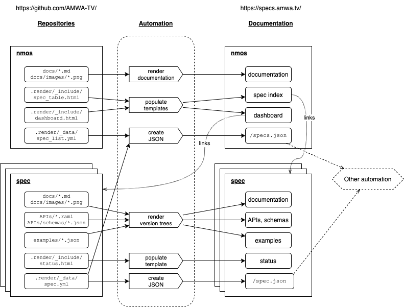

# Networked Media Open Specifications

 
 

<!-- INTRO-START -->

NMOS is a family name for specifications produced by the Advanced Media Workflow Association related to networked media for professional applications.

For a non-technical introduction to NMOS see AMWA's [overview page](https://www.amwa.tv/nmos-overview) and [NMOS Roadmap](https://static.amwa.tv/nmos-roadmap-version-2(2023-08-07).pdf).

The tables below list the current specifications and provide links to their documentation on [specs.amwa.tv](https://specs.amwa.tv). The "Release" links will take you to the documentation and download page (↓) for the latest release of recent versions of the specification.

> The tables no longer include direct links to the GitHub repos. These are available through the [NMOS CI Dashboard](https://specs.amwa.tv/nmos-dashboard/dashboard.html).

The [NMOS API Testing Tool](https://specs.amwa.tv/nmos-testing) supports the majority of these specifications.

### [NMOS Interface Specifications (IS)](is/)

These specify NMOS APIs using RAML, JSON Schema and normative text, supported by examples and other text:



### [NMOS Data Model Specifications (MS)](ms/)

These model the resources used in NMOS APIs:



### [NMOS Best Common Practices (BCP)](bcp/)

These specify best practice for use of NMOS APIs:



### [NMOS Informative Documents (INFO)](info/)

These provide NMOS implementation guides:



### [NMOS Parameter Registers](https://specs.amwa.tv/nmos-parameter-registers)

These specify constants for many types of NMOS parameter values:



### [NMOS Control Feature Sets](https://specs.amwa.tv/nmos-control-feature-sets)

These specify opt-in models for the NMOS Control Framework



<!-- INTRO-END -->

> The table of NMOS specs is no longer contained in this README, but is generated on demand from YAML files in each spec repo and rendered at <https://specs.amwa.tv/nmos>:
>
> 
